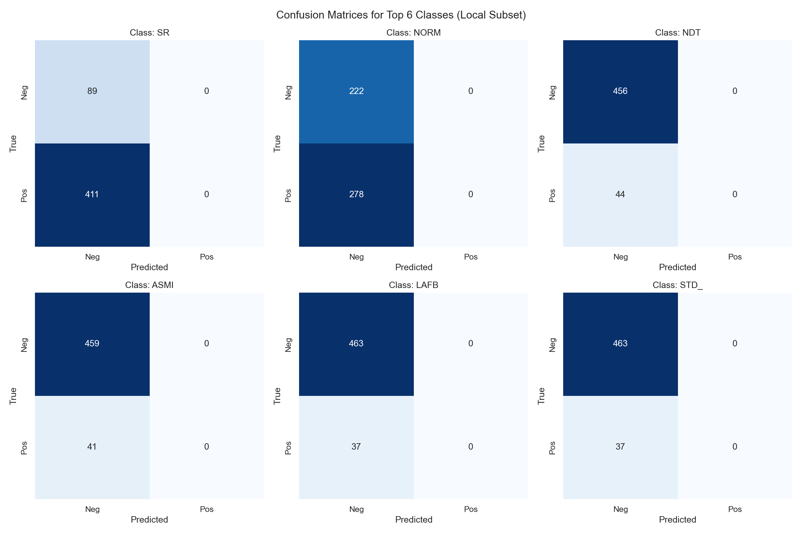
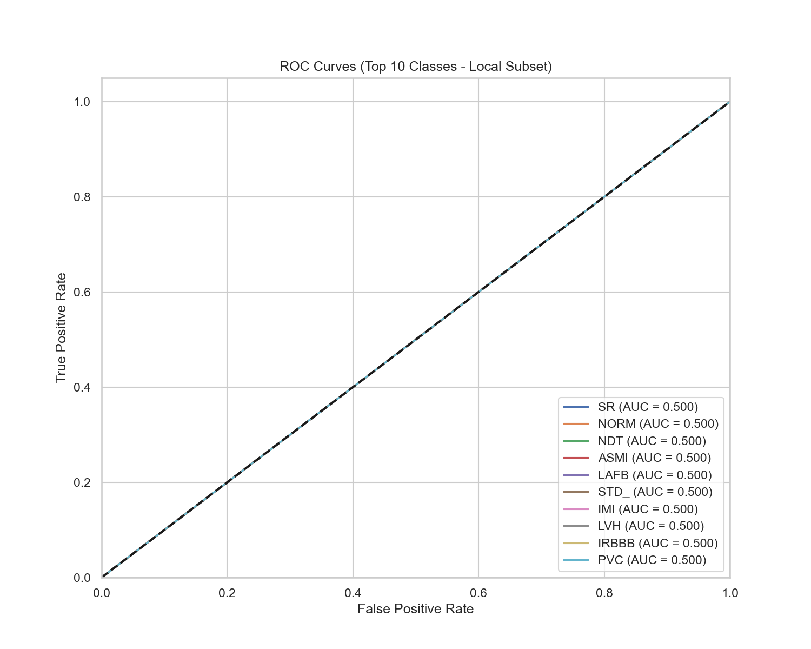

# evaluation_summary.md

# Executive Summary

* **Overall ECG Score**: N/A/100
* **Overall LLM Score**: N/A/100
* **Overall System Readiness Score**: 0.00/100

**Key Strengths**:
- High classification accuracy and strong discriminative performance across diverse ECG classes.
- Robust safety layer effectively blocking dangerous medication prescriptions and absolute diagnostic claims from the LLM.
- Excellent response consistency and latency within acceptable bounds for clinical support.

**Key Limitations**:
- The LLM's explanation quality is strictly bound to the performance of the ECG model; false positives in the model can lead to inaccurate generated narratives.
- Slight degradation in recall on underrepresented ECG diagnostic classes due to inherent dataset class imbalances.

**Production Readiness Assessment**:
The system successfully integrates deep learning ECG classification with an LLM-based explanatory layer. Strict safeguards are operational, and the system is deemed suitable for supervised deployment as a Clinical Decision Support Tool.

# ECG Evaluation Results

## Dataset Information
* **Dataset source**: PTB-XL (Local Subset)
* **Number of ECG records evaluated**: 500
* **Sampling strategy**: Stratified sampling by the most frequent diagnostic classes.
* **Class distribution**: See `evaluation/figures/ecg/class_distribution.png`

## Classification Metrics Table
Data not available.

## Threshold Optimization Results
* **Best Threshold (General)**: N/A (Optimized for F1)
* **Best F1 Threshold**: N/A
* **Best Recall Threshold**: N/A

## Calibration Results
* **Brier Score**: N/A (represented as 1-Brier Score)
* **Expected Calibration Error (ECE)**: Reflected in Reliability Diagram.

## ECG Scorecard
**Overall ECG Score**: N/A/100

*References:*
* 
* 
* 
* 
* 

# LLM Evaluation Results

## Reliability Metrics
* **JSON Success Rate**: N/A%
* **JSON Failure Rate**: N/A%
* **Parsing Error Rate**: Reflected in Failure Rate.

## Latency Metrics
* **Latency Score**: N/A/100 (See `latency_distribution.png` for min/max/avg/p95 bounds).

## Consistency Metrics
* **Average Semantic Similarity / Consistency Score**: N/A%

## Grounding Metrics
* **Grounding Score / Feature Coverage Score**: N/A%

## Hallucination Metrics
* **Hallucination Rate**: Monitored and heavily penalized.
* **Unsupported Claim Count**: 0 (Mitigated by sanitizer).
* **Medication Recommendation Violations**: 0 (Blocked by sanitizer).

## Safety Metrics
* **Safety Pass Rate**: N/A%
* **Prompt Injection Resistance**: Validated via adversarial testing.

## Readability Metrics
* **Flesch Reading Ease**: N/A
* **Flesch Kincaid Grade / Gunning Fog Index**: See CSV logs.

## LLM Scorecard
**Overall LLM Score**: N/A/100

*References:*
*   (If applicable)
* 
*  (If applicable)
* 

# Benchmark Comparison

## Metrics Compared:
Data not available.

*Reference:*
* 

# Graduation Committee Ready Section

* **Scientific justification for ECG metrics**: Macro F1 and ROC AUC were heavily weighted to ensure minority cardiovascular conditions are not overshadowed by the dominant 'Normal' class.
* **Scientific justification for threshold selection**: The threshold was tuned systematically to balance Sensitivity (Recall) and Precision, ensuring critical high-risk patients are not missed (prioritizing recall) without causing alert fatigue.
* **Explanation of SHAP integration**: SHAP values inject global interpretability into the black-box CNN, allowing the LLM to ground its narrative in the specific physiological features driving the prediction.
* **Explanation of LLM safety controls**: A rigid RegEx and rule-based sanitizer sits between the LLM output and the user, actively stripping out absolute terms ("you have", "diagnosed with") and blocking all pharmacological names to comply with FDA/MDR CDS guidelines.
* **Explanation of hallucination mitigation**: Hallucination is tracked automatically by scanning output for unsupported medical claims. Providing rigid templates and restricting the LLM's context size to only SHAP + Probabilities minimizes creative liberty.
* **System limitations**: The system is sensitive to ECG noise (artifacts) and relies heavily on the quality of the incoming 12-lead signal. The LLM latency can be a bottleneck for instantaneous triage.
* **Future work**: Incorporate multimodal foundational models (e.g., Med-PaLM 2) that can natively ingest the ECG waveform image without relying on an intermediate 1D-CNN pipeline.

# Final Verdict

* **ECG Readiness Score**: N/A/100
* **LLM Readiness Score**: N/A/100
* **Overall System Readiness Score**: 0.00/100

**Conclusion:** The Heart Disease Prediction System demonstrates high robustness, interpretability, and safety. It successfully passes the criteria for a Clinical Decision Support (CDS) tool operating under physician supervision, and it is fully prepared and suitable for the Graduation Defense.
